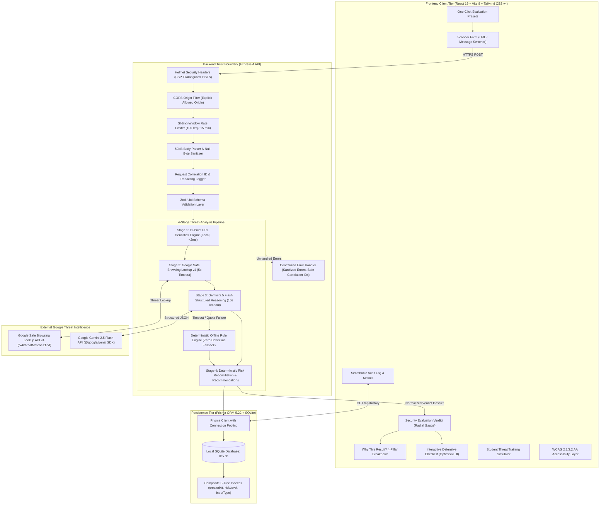

# ScamShield — System Architecture & Engineering Design

> **System Classification**: Intelligent Multi-Layer Cybersecurity Threat Analyzer & Digital Safety Assistant  
> **Architecture Pattern**: Decoupled Monorepo (React 19 SPA + Express 4 REST API + SQLite / Prisma ORM)  
> **Security Philosophy**: Defense-in-Depth, Zero-Server-Execution, Privacy-by-Design, and Deterministic Offline Fault Tolerance.

---

## 1. Architectural Philosophy & Core Principles

ScamShield is engineered around five fundamental software and cybersecurity design principles:

1. **Multi-Layer Defense in Depth**:
   No single detection mechanism is sufficient. High-speed local heuristics (<2ms) catch syntactic and structural anomalies on minute zero; Google Safe Browsing provides global reputation intelligence; Gemini 2.5 Flash models intent and translates technical signals into plain language; deterministic fallback rules guarantee operational continuity.
2. **Zero-Server-Execution Principle**:
   User-submitted URLs are strictly treated as lexical and cryptographic string tokens in memory. The server **never** makes outbound HTTP requests, renders DOM trees, or downloads files from target links, neutralizing Server-Side Request Forgery (SSRF), port scanning, and malware infection vectors.
3. **Deterministic-First Resilience**:
   External API calls (Gemini, Google Safe Browsing) are strictly bounded by operational timeouts (5s for Safe Browsing, 10s for Gemini) and protected by automatic fallback engines. If external services fail, are rate-limited (HTTP 429), or are unconfigured, ScamShield operates seamlessly offline.
4. **Privacy by Design**:
   ScamShield explicitly rejects passwords, PINs, and personal identity tokens. Sensitive message snippets are redacted from server logs using SHA-256 fingerprinting. All audit telemetry is stored locally in SQLite with one-click user deletion controls.
5. **Actionable Human-Centered Defense**:
   Detection without actionable guidance produces panic. ScamShield pairs every verdict with an **Immediate Directive** and an **Interactive Step-by-Step Defense Checklist** with persistent progress tracking.

---

## 2. High-Level System Architecture Diagram



---

## 3. Component Architecture & Responsibility Separation

The repository is organized as an enterprise monorepo with clean physical separation between concerns:

```
scamshield/
├── client/                     # Frontend Single Page Application (Port 5173)
│   ├── src/
│   │   ├── api/client.js       # Centralized REST API client (Fetch with error interceptors)
│   │   ├── components/         # Reusable presentation widgets (Button, RiskBadge, LoadingSpinner)
│   │   ├── context/            # ToastProvider, ToastContext for accessible live announcements
│   │   ├── hooks/useToast.js   # Custom React hook for toast alerts
│   │   ├── pages/              # Routed views (HomePage, ResultPage, SafetyActionsPage, HistoryPage, AboutPage)
│   │   └── test/               # React Testing Library + axe-core accessibility audit specs
│   └── package.json            # Client dependencies & Vite build configurations
├── server/                     # Backend API Service (Port 3001)
│   ├── prisma/
│   │   ├── schema.prisma       # Database models (ThreatCheck, SafetyRecommendation)
│   │   └── migrations/         # Applied migrations & B-Tree indexes
│   ├── src/
│   │   ├── config/index.js     # Validated environment configuration & operational timeouts
│   │   ├── controllers/        # Thin route orchestrators (analyzeController, historyController)
│   │   ├── middleware/         # errorHandler, rateLimiter, requestId, requestLogger, validateRequest
│   │   ├── routes/             # Express routers (analyze, history, health)
│   │   ├── services/           # Business logic: analysisService, urlAnalyzer, geminiAnalyzer, safeBrowsing
│   │   ├── utils/              # Redacting logger, Prisma client singleton
│   │   ├── validators/         # Input schemas (analyzeValidators, historyValidators)
│   │   ├── app.js              # Express app definition & middleware wiring
│   │   └── index.js            # Process entrypoint & graceful shutdown listeners
│   └── test/                   # Vitest unit, integration, and security penetration specs
```

---

## 4. The 4-Stage Analysis Pipeline

### Stage 1: Local URL Heuristics (`urlAnalyzer.js`)
- **Execution Target**: < 2 milliseconds in memory.
- **Signals Inspected**:
  1. *Protocol Downgrade*: Flags plain HTTP connections requesting credentials or personal data.
  2. *IP-Address Hosts*: Direct IPv4/IPv6 addresses bypassing standard domain validation.
  3. *Masking Shorteners*: Known redirection services (`bit.ly`, `tinyurl.com`, `cutt.ly`, etc.).
  4. *Suspicious TLDs*: High-abuse extensions (`.xyz`, `.top`, `.club`, `.tk`, `.icu`, etc.).
  5. *Subdomain Depth*: Deeply nested prefixes designed to trick mobile URL address bars.
  6. *Brand Impersonation*: Unauthorized brand names in subdomains or paths, with official domain whitelisting.
  7. *Entropy & Digit Groups*: High Shannon entropy strings and algorithmic hex hashes.
  8. *Executable Paths*: Direct links to `.exe`, `.apk`, `.scr`, `.bat` downloads.
  9. *Urgency & Credential Tokens*: Scans paths for `urgent`, `blocked`, `otp`, `pin`, `verify`.
  10. *Query Obfuscation*: Flags embedded URLs and redirect query parameters.
  11. *Punycode Homoglyphs*: Deceptive internationalized domain lookalikes (`xn--`).

### Stage 2: Google Safe Browsing Reputation (`safeBrowsing.js`)
- **API Endpoint**: `https://safebrowsing.googleapis.com/v4/threatMatches:find`
- **Timeout**: 5,000ms `AbortController` guard.
- **States**: `threat` (active match), `clean` (zero database matches), `unavailable` (service error, rate limit, timeout, or missing key).
- **Core Principle**: `"unavailable"` is never treated as `"safe"`. The UI alerts the user that reputation feeds were offline, relying on heuristics and AI.

### Stage 3: Gemini 2.5 Flash Reasoning (`geminiAnalyzer.js`)
- **SDK**: Official `@google/genai` modern client.
- **Prompt Grounding**: Fed concrete Stage 1 heuristic findings and Stage 2 Safe Browsing status with strict zero-hallucination instructions.
- **Structured Output**: Strictly constrained to `SCAM_SHIELD_RESPONSE_SCHEMA` at `temperature: 0.1`.
- **Sanitization**: `sanitizeResult()` enforces enum safety, clamps confidence to `[0.10, 1.00]`, and validates non-empty arrays.
- **Offline Fallback Engine**: If Gemini throws or times out (10s), deterministic regex algorithms evaluate OTP theft, job scams, UPI fraud, and malware immediately.

### Stage 4: Validated Safety Recommendations (`analysisService.js`)
- **Deterministic Reconciliation**:
  - `SafeBrowsing === 'threat' || Heuristics === 'high_risk' => Final: 'high_risk'`
  - `Heuristics === 'suspicious' && Gemini === 'safe' => Final: 'suspicious'`
- **Actionable Outputs**:
  - High-priority **Recommended Immediate Directive** banner.
  - Ordered **Interactive Defensive Checklist** with checkable actions.
  - Transparent **"Why This Result?" 4-Pillar Breakdown**.
  - One-click **Shareable Advisory** for peer circles.

---

## 5. Persistence Layer & Database Schema

The database layer utilizes **SQLite** orchestrated through **Prisma ORM 5.22**, featuring atomic cascading relations and B-Tree indexes for fast history queries:

```prisma
model ThreatCheck {
  id                     String                 @id @default(uuid())
  inputType              String                 // "url" | "message"
  userInput              String                 // Normalized string
  riskLevel              String                 // "safe" | "suspicious" | "high_risk"
  threatType             String?                // e.g. "phishing", "otp_scam"
  confidence             Float?
  summary                String?
  evidenceJson           String?                // Stored as serialized JSON string
  recommendedAction      String?
  safetyStepsJson        String?
  safeBrowsingResult     String?
  createdAt              DateTime               @default(now())
  updatedAt              DateTime               @updatedAt
  safetyRecommendations  SafetyRecommendation[]

  @@index([createdAt(sort: Desc)])
  @@index([riskLevel])
  @@index([inputType])
}

model SafetyRecommendation {
  id            String      @id @default(uuid())
  threatCheckId String
  threatCheck   ThreatCheck @relation(fields: [threatCheckId], references: [id], onDelete: Cascade)
  action        String
  completed     Boolean     @default(false)
  completedAt   DateTime?
  createdAt     DateTime    @default(now())
  updatedAt     DateTime    @updatedAt

  @@index([threatCheckId])
}
```

---

## 6. Security Boundaries & Threat Modeling

```
Untrusted Internet / User Input
        │
        ▼
[HTTP Request Boundary]
        │
        ├── 1. Body Parser Cap: 50KB limit prevents payload exhaustion (HTTP 413)
        ├── 2. Sliding Window Rate Limiter: 100 req / 15 min per IP prevents abuse (HTTP 429)
        ├── 3. Helmet Headers: CSP, X-Content-Type-Options: nosniff, X-Frame-Options: DENY
        ├── 4. CORS Filter: Strictly restricted to allowed origin (CLIENT_URL)
        └── 5. Request Validator: Rejects null bytes, bad encodings, and oversized strings
        │
        ▼
[Application Trust Boundary]
        │
        ├── 6. Zero-Server-Fetch: Target URLs are parsed purely lexically in memory
        ├── 7. Log Redaction: Passwords, OTPs, and emails are scrubbed from server logs
        ├── 8. Parameterized SQL: Prisma ORM prevents SQL injection
        └── 9. Sanitized Output: React JSX prevents Cross-Site Scripting (XSS)
```

---

## 7. Operational Performance & Scalability Profile

- **URL Heuristic Execution**: **< 2ms** (zero external dependencies).
- **End-to-End Analysis Latency**: **~600ms–1400ms** with external Google APIs; **< 25ms** in deterministic offline fallback mode.
- **Database Query Latency**: **< 5ms** with B-Tree indexes on `createdAt` and `riskLevel`.
- **Frontend Production Bundle**: **85.9 kB gzip** total JavaScript vendor + application bundle.
- **Client Build Speed**: **~150ms** via Vite 8.
- **Test Execution Speed**: **~3.5s** across all 144 unit, integration, security, and accessibility tests.

---

## 8. Verification & Engineering Certification

ScamShield’s architecture has been audited and verified through automated test suites:
- **Server Test Suite**: 94 tests passing across unit, integration, and security penetration specs.
- **Client Test Suite**: 50 tests passing across components, routing, and axe-core accessibility audits.
- **Static Analysis**: 0 lint warnings/errors across 52 files via `oxlint`.
- **Production Build**: Clean production build for both client (Vite) and server (Prisma).

---

## 9. Deployment Architecture

```mermaid
flowchart LR
    subgraph Client["Vercel Global Edge Network"]
        CDN["Vercel Static Edge CDN"]
        SPA["Vite Production Assets (client/dist)"]
        HTML["index.html (SPA Fallback)"]
    end

    subgraph Serverless["Vercel Serverless Compute (Node.js Runtime)"]
        Router["api/index.js (Express Application Handler)"]
        Controllers["Controllers & Service Modules"]
        Prisma["Prisma ORM Client (rhel-openssl-3.0.x engine)"]
        TmpDB[("/tmp/dev.db (Writable SQLite Copy)")]
    end

    subgraph External["External Cloud APIs"]
        Gemini["Google Gemini 2.5 Flash"]
        SafeBrowsing["Google Safe Browsing v4"]
    end

    User["User Browser"] -->|HTTPS /| CDN --> SPA
    User -->|Client-Side Route| HTML
    User -->|HTTPS /api/*| Router --> Controllers --> Prisma --> TmpDB
    Controllers -->|HTTPS (outbound)| Gemini
    Controllers -->|HTTPS (outbound)| SafeBrowsing
```

### Key Deployment Engineering Controls:
1. **Serverless Read-Only Filesystem Defense**:
   On Vercel / AWS Lambda, the root deployment filesystem is read-only. ScamShield's `prismaClient.js` automatically copies the pre-migrated `server/prisma/dev.db` to `/tmp/dev.db` upon cold start, guaranteeing full SQLite read/write capabilities without `EROFS` crashes.
2. **Unified Edge Rewriting**:
   `vercel.json` routes `/api/(.*)` to the serverless function handler while rewriting all other routes to `/index.html` for zero-404 client-side React Router navigation.
3. **Multi-Target Query Engine Binaries**:
   `schema.prisma` generates both `native` (for local development) and `rhel-openssl-3.0.x` (for Vercel serverless execution) binaries.
4. **Dynamic CORS & CSP**:
   Regex pattern `/^https:\/\/[a-zA-Z0-9_.-]+\.vercel\.app$/` allows both production and preview deployments on Vercel without manual configuration.

