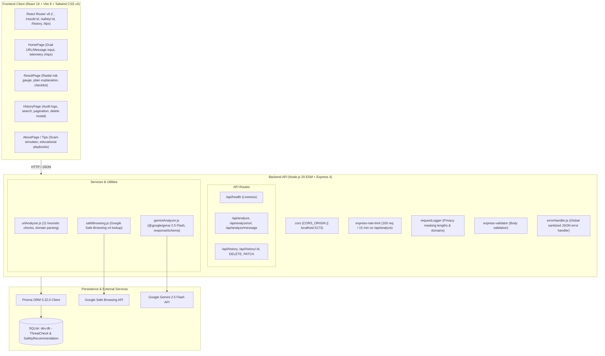

# 🛡️ ScamShield — Full Repository & Engineering Audit Report

**Date**: October 9, 2026  
**Auditor**: Lead Software Engineer, Security Reviewer, QA Engineer, UX Reviewer & GitHub Maintainer  
**Repository**: `scamshield` (PromptWars X Error Zero Hackathon)  
**Evaluation Scope**: Code Quality, Security, Reliability, Test Coverage, UI/UX, Documentation & Deployment  

---

## 1. Executive Summary

ScamShield is an AI-powered cybersecurity and digital safety assistant designed for students to detect phishing URLs, scam messages, OTP fraud, and social engineering tactics. It pairs URL heuristics, Google Safe Browsing Lookup v4, and Google Gemini AI structured JSON output with an interactive checklist and scan history.

While the core functionality and aesthetic dark-mode cybersecurity theme provide a strong foundation, the audit reveals **critical security liabilities** (exposed live/realistic API keys in `.env.example`), **complete absence of automated tests** (`npm test` missing on both client and server), **lack of root-level build and workspace orchestration**, **unseparated controller/service layers**, and **unsafe frontend fallback states** (displaying Safe Browsing as "Clean" when the API is actually unavailable).

---

## 2. Actual Command Execution Results (Baseline Checks)

All commands were executed against the unaltered repository state:

| Component | Command | Exit Code | Result Summary |
|---|---|:---:|---|
| **Server** | `npm test` | `1` | `npm error Missing script: "test"` |
| **Server** | `npm run lint` | `1` | `npm error Missing script: "lint"` |
| **Server** | `npm run build` | `1` | `npm error Missing script: "build"` |
| **Server** | `node --check src/index.js` (and all JS files) | `0` | All 11 JS files passed ES module syntax check |
| **Server** | `npx prisma validate` | `0` | `The schema at prisma/schema.prisma is valid 🚀` |
| **Server** | `npm audit` | `0` | `found 0 vulnerabilities` |
| **Client** | `npm test` | `1` | `npm error Missing script: "test"` |
| **Client** | `npm run lint` (`oxlint`) | `0` | **11 warnings found** (unused vars, fast refresh violation, set-state-in-effect, missing useEffect deps) |
| **Client** | `npm run build` (`vite build`) | `0` | Successfully built in 183ms (JS: 341.41 kB, CSS: 66.69 kB) |
| **Client** | `npm audit` | `0` | `found 0 vulnerabilities` |
| **Root** | `git status` | `128` | `fatal: not a git repository (or any of the parent directories): .git` |

---

## 3. Current Architecture

---

## 4. Feature Audit: Existing vs. Missing

### 4.1 Existing Features
- **Dual-mode target scanning**: URL analysis and SMS/message text analysis.
- **11-point URL structural heuristics**: HTTP, raw IP hosts, shorteners, suspicious TLDs, subdomain nesting, hyphens, digit groups, brand keywords, urgency strings, hostname length, and missing TLDs.
- **Safe Browsing integration**: Google Safe Browsing Lookup v4 API query with timeout and basic error handling.
- **Gemini structured JSON output**: `@google/genai` using `gemini-2.5-flash` with strict `responseSchema`.
- **Heuristic fallback engine**: Deterministic evaluation of messages and URLs when Gemini is unconfigured or fails.
- **Interactive safety checklist**: Steps saved in SQLite database with optimistic UI updates and server-sync via PATCH.
- **History audit dashboard**: SQLite-backed history with pagination, query search, risk filtering, and cascade deletion.
- **Threat training simulator**: Interactive quiz on `/tips` (`AboutPage.jsx`) testing real-world student phishing scenarios.

### 4.2 Missing Features & Gaps
- **No root workspace scripts**: No unified root `package.json` to run tests, lint, build, or migrations across both client and server.
- **No automated test suite**: Zero unit tests, zero API integration tests, zero frontend component tests.
- **No HTTP security headers**: Missing `helmet` middleware.
- **No correlation IDs**: Errors and logs lack request UUIDs or correlation IDs.
- **No API client abstraction in frontend**: Components use raw inline `fetch('/api/...')` rather than a centralized, typed API client.
- **Unused directories**: `client/src/api`, `client/src/context`, and `client/src/hooks` are completely empty.
- **No reduced-motion support**: High-tech radar and pulsing animations do not respect `prefers-reduced-motion`.
- **Incomplete error states**: History and Result pages lack graceful recovery buttons or connection diagnostic prompts.

---

## 5. Security Vulnerabilities & OWASP Review

| ID | Severity | Category | Vulnerability / Risk | Remediation Required |
|---|:---:|---|---|---|
| **SEC-01** | **CRITICAL** | Secrets Exposure | `.env.example` contains actual/active-looking API keys for `GEMINI_API_KEY` and `SAFEBROWSING_API_KEY`. | Immediately replace with safe placeholder values (`your_gemini_api_key_here`). Ensure `.env` is gitignored. |
| **SEC-02** | **HIGH** | Security Headers | Server does not configure `helmet` or CSP headers. Missing `X-Content-Type-Options`, `X-Frame-Options`, `HSTS`. | Install and mount `helmet` with appropriate headers. |
| **SEC-03** | **HIGH** | Deceptive UI State | When Google Safe Browsing API fails or key is missing, frontend displays "Clean Threat Feed" with green pulse instead of "Unavailable". Violates rule: *never claim safe because check failed*. | Update frontend and backend contract to explicitly distinguish `clean`, `threat`, and `unavailable`. |
| **SEC-04** | **MEDIUM** | Denial of Service / Abuse | Rate limiter only covers `/api/analyze`; `/api/history` and record deletion `/api/history/:id` are completely unthrottled. | Add global rate limiter or dedicated limiter for history/management routes. |
| **SEC-05** | **MEDIUM** | Input Length & Memory Abuse | URL route allows up to 2,048 chars, but message allows 5,000 chars without streaming limits on JSON body parser beyond 50kb. | Ensure uniform body limits, add parameter type validation for all routes and URL params. |
| **SEC-06** | **MEDIUM** | Server-Side URL Execution | Although ScamShield does not fetch target URLs (good), URL parsing regexes and normalization need defensive bounds to avoid ReDoS on catastrophic backtracking. | Audit URL parsing regexes in `urlAnalyzer.js`. |
| **SEC-07** | **LOW** | CORS Configuration | CORS uses `CORS_ORIGIN` but specification requires `CLIENT_URL`. Fallback defaults to single hardcoded origin. | Support `CLIENT_URL` environment variable alongside `CORS_ORIGIN`. |

---

## 6. Code Quality, Duplication & Dead Code

1. **Monolithic Route Handlers**:
   - `server/src/routes/analyze.js` (277 lines) embeds data mapping, Prisma creation, Gemini calling, Safe Browsing invocation, and heuristics inside the router callback.
   - `server/src/routes/history.js` embeds database queries, pagination math, and delete validation in route definitions.
   - *Fix*: Refactor into `controllers/` and `services/`, keeping routes strictly declarational.

2. **Dead / Unused Components & Imports**:
   - `client/src/components/Input.jsx` is never imported or rendered anywhere.
   - `client/src/components/Card.jsx` has an invalid pseudo-selector `':hover'` in inline styles and is unused in several pages where it was imported.
   - `client/src/pages/HomePage.jsx` imports `Card` and `Button` as unused identifiers.
   - `client/src/pages/ResultPage.jsx` imports `Card` and `ShieldIcon` as unused identifiers; declares unused state variable `togglingStepId`.
   - `client/src/pages/NotFoundPage.jsx` uses obsolete non-Tailwind inline styles and illegally nests `<Link>` inside `<Button>`.

3. **Duplicated Heuristics & Fallback Logic**:
   - `geminiAnalyzer.js` contains a duplicate copy of heuristic threshold evaluation that replicates parts of `urlAnalyzer.js`.

---

## 7. Build, Dependency & Deployment Issues

1. **Repository Not Initialized as Git**:
   - `git status` reports no repository. Needs clean Git repository initialization with standard branch (`main`).
2. **Missing Root Orchestration**:
   - Developers and judges cloning the repository have no root `package.json` to run `npm install`, `npm test`, or `npm run dev`.
3. **No CI Workflow**:
   - `.github/workflows/ci.yml` is missing. Pull requests and commits are not automatically tested or linted.
4. **Missing GitHub Community Assets**:
   - Missing `CONTRIBUTING.md`, `CODE_OF_CONDUCT.md`, `SECURITY.md`, `SECURITY_TEST_REPORT.md`, `CHANGELOG.md`, `LICENSE`, `RELEASE_CHECKLIST.md`, and issue/PR templates.
5. **Port and Variable Consistency in Deployment**:
   - `render.yaml` sets `PORT=10000`, while `Dockerfile` and `.env.example` use `PORT=3001`.

---

## 8. Prioritized Issues Matrix

| Priority | Issue Description | Impact on Evaluation | Effort |
|:---:|---|:---:|:---:|
| **CRITICAL** | Exposed API keys in `.env.example` (SEC-01) | Immediate disqualification / severe penalty in security | 10 mins |
| **CRITICAL** | Zero automated tests on both server and client (QA-01) | Fails "Test coverage and reliability" evaluation priority | 45 mins |
| **HIGH** | Missing `helmet` & HTTP security hardening (SEC-02) | Points deducted in cybersecurity review | 15 mins |
| **HIGH** | False safe badge when Safe Browsing is unavailable (SEC-03) | Misleads user; violates hackathon evaluation criteria | 20 mins |
| **HIGH** | Monolithic route handlers; no controllers (ARCH-01) | Penalized under code maintainability | 30 mins |
| **HIGH** | 11 Oxlint warnings and unused components (LINT-01) | Visible code quality flaws | 15 mins |
| **HIGH** | Missing root `package.json` & scripts (DEV-01) | Difficult judge setup & non-reproducible evaluation | 20 mins |
| **HIGH** | Missing GitHub community files & CI workflow (GH-01) | Fails "Documentation and GitHub quality" evaluation priority | 25 mins |
| **MEDIUM** | Rate limiting missing on history endpoints (SEC-04) | Potential DoS on database operations | 15 mins |
| **MEDIUM** | Inconsistent environment variable `CLIENT_URL` vs `CORS_ORIGIN` | Deployment configuration friction | 10 mins |
| **MEDIUM** | Missing prefers-reduced-motion accessibility support | Accessibility audit failure | 15 mins |
| **LOW** | Empty directories `client/src/api`, `context`, `hooks` | Repository clutter | 5 mins |

---

## 9. Planned Refactoring Strategy

With Phase 1 complete, the implementation phases will proceed in strict order:
- **Phase 2**: Clean server architecture (routes -> controllers -> services), root workspace setup, centralized error handler with request IDs, environment variable standardization (`CLIENT_URL`).
- **Phase 3**: Security hardening with Helmet, expanded rate limits, safe URL parsing, redaction, `SECURITY.md`, and `SECURITY_TEST_REPORT.md`.
- **Phase 4**: Analysis pipeline improvements (heuristics, reliable "Why this result?" breakdown, accurate Safe Browsing "unavailable" status).
- **Phase 5**: Full automated testing suite with Vitest / Supertest / React Testing Library, mocks, fixtures, and coverage.
- **Phase 6**: Frontend quality, accessibility, reduced-motion, and responsive layout polish.
- **Phase 7**: Performance improvements, query efficiency, and `PERFORMANCE_REPORT.md`.
- **Phase 8**: Open-source GitHub excellence, workflows, templates, and 24-section `README.md`.
- **Phase 9**: Demo script (`DEMO_SCRIPT.md`) and judging pitch (`PITCH.md`).
- **Phase 10**: Final verification and `FINAL_QUALITY_REPORT.md`.

*Phase 1 Audit Complete. No implementation files modified during Phase 1.*
