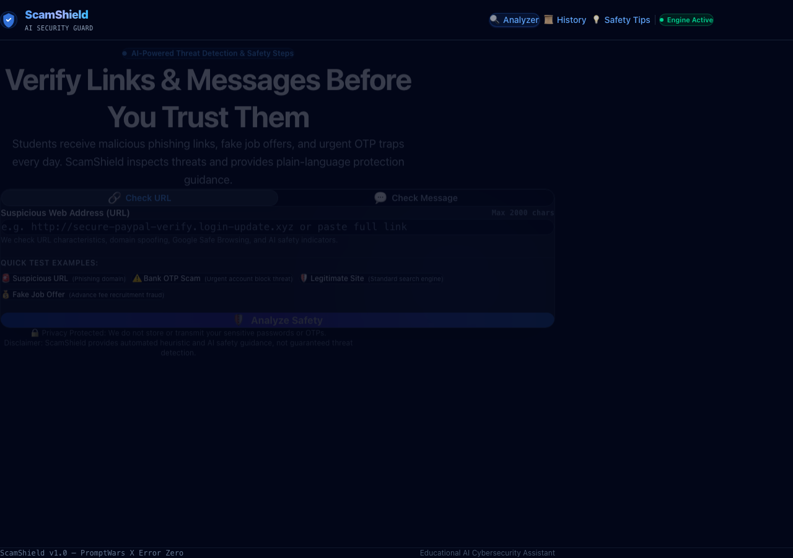
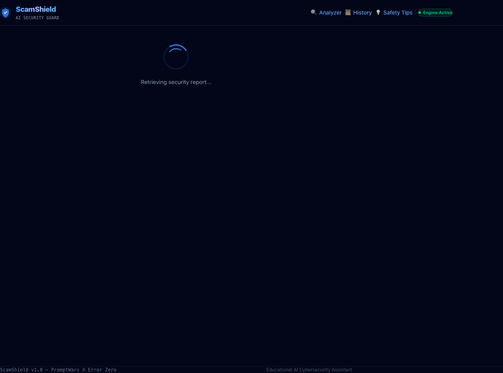
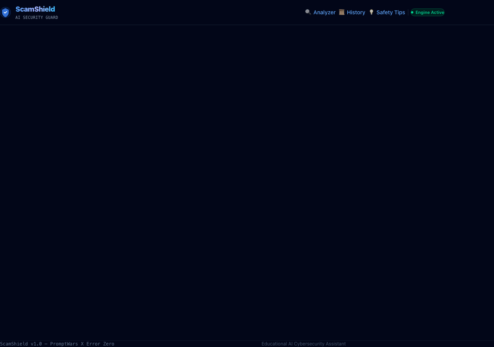
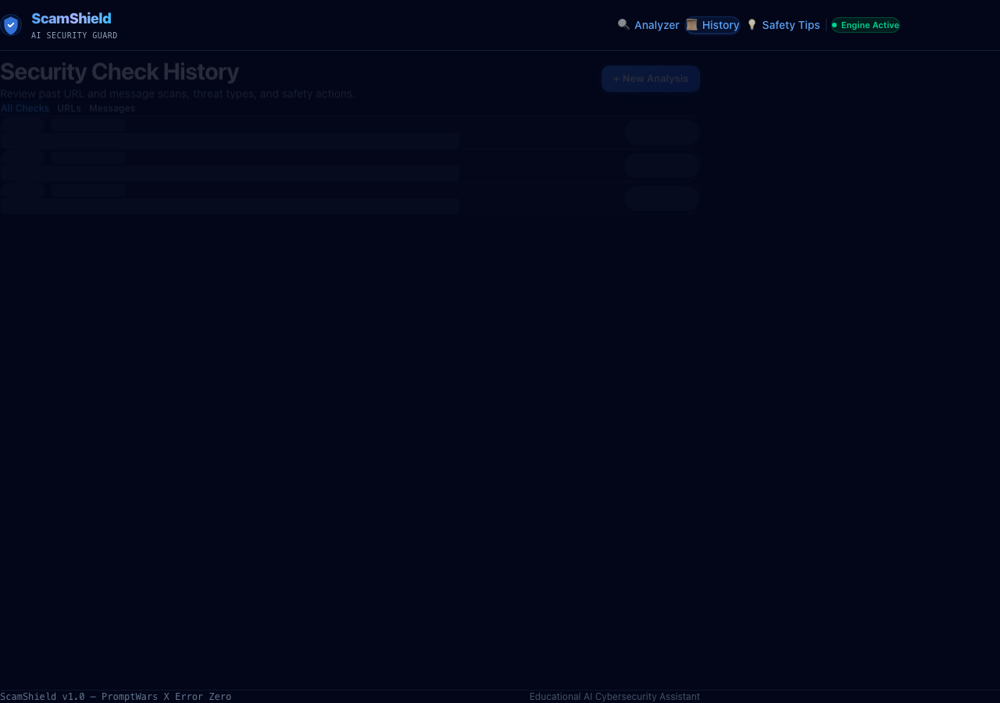
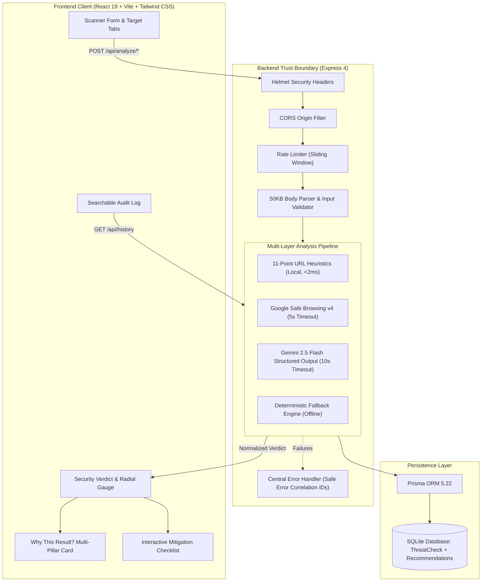
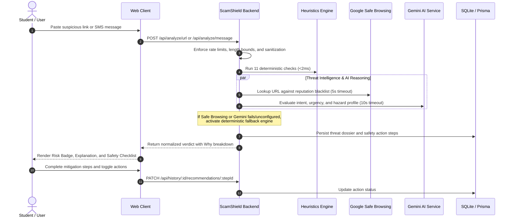

# 🛡️ ScamShield — AI-Powered Digital Safety Assistant

> **One-line summary**: ScamShield is an explainable AI cybersecurity assistant that detects suspicious URLs and scam messages using Google Safe Browsing, Gemini, and security heuristics, then provides clear, actionable recommendations to help users stay safe online.

ScamShield is an intelligent cybersecurity assistant that helps students identify phishing links, fraudulent websites, scam messages, OTP scams, fake payment requests, and other social-engineering threats before they cause harm.

Users can paste a suspicious URL or message into ScamShield and receive an understandable, evidence-based safety assessment. The platform combines deterministic URL heuristics, Google Safe Browsing reputation checks, and Gemini-powered structured analysis to classify potential threats, explain why they are suspicious, and recommend clear actions such as avoiding the link, refusing to share credentials or OTPs, verifying through an official channel, reporting the sender, or blocking the source.

---

### 🌐 Live Production Links & Status

- **Live Application**: [https://scamshield-kohl.vercel.app](https://scamshield-kohl.vercel.app)
- **GitHub Repository**: [https://github.com/psryogeshwar-14/scamshield](https://github.com/psryogeshwar-14/scamshield)
- **CI Quality Gate**: [](https://github.com/psryogeshwar-14/scamshield/actions/workflows/ci.yml)
- **Vercel Project Dashboard**: [https://vercel.com/yogeshwar1/scamshield](https://vercel.com/yogeshwar1/scamshield)

---

### Core capabilities

- **Suspicious URL analysis**: Examines HTTPS usage, IP-based domains, URL shorteners, excessive subdomains, suspicious keywords, unusual patterns, and possible brand impersonation.
- **Google Safe Browsing integration**: Checks submitted URLs against Google’s continuously updated lists of unsafe resources, including phishing and malware-hosting websites.[[1]](#references)[[2]](#references)
- **AI-powered scam-message classification**: Identifies patterns associated with phishing, OTP fraud, payment scams, fake job offers, impersonation, malware delivery, and account takeover attempts.
- **Explainable results**: Separates technical indicators from AI interpretation and presents the findings in simple, student-friendly language.
- **Actionable recommendations**: Provides immediate safety steps instead of displaying only a risk score.
- **Structured AI responses**: Gemini returns predictable JSON according to a defined schema, which the application validates before displaying or storing results.[[3]](#references)[[4]](#references)
- **Analysis history**: Stores previous checks so users can review detected patterns and safety recommendations.
- **Graceful failure handling**: Clearly distinguishes between a confirmed threat, no known match, insufficient evidence, and an unavailable external service.
- **Accessible interface**: Supports keyboard navigation, visible focus states, readable contrast, semantic labels, responsive layouts, and risk indicators that do not rely only on color.

---

### How it works

```text
User submits URL or message
              ↓
Input validation and safe normalization
              ↓
URL heuristics or scam-pattern analysis
              ↓
Google Safe Browsing reputation check
              ↓
Gemini structured threat explanation
              ↓
Application-level response validation
              ↓
Risk level, evidence, explanation, and safety actions
```

---

### Security and privacy

ScamShield does not ask users for passwords, OTPs, payment details, or unnecessary personal information. API keys are stored on the server through environment variables, user input is validated, external-service failures are handled safely, and the application does not automatically report, block, or execute actions without user confirmation.

ScamShield is a safety-assistance prototype, not a guaranteed malware or phishing detector. A URL that does not appear on a known Safe Browsing list should not automatically be considered safe, because reputation services cannot identify every newly created or undiscovered threat. Google describes Safe Browsing as a service for checking URLs against known unsafe-resource lists, including phishing and malware resources.[[5]](#references)[[1]](#references)

---

### Problem-statement alignment

ScamShield directly addresses the cybersecurity and digital-safety challenge (*"Build an intelligent system that identifies or analyzes cybersecurity threats and provides actionable security recommendations"*) by:

1. Identifying suspicious digital content.
2. Combining rule-based detection with Google security services and Gemini AI.
3. Explaining threats to non-technical users.
4. Providing practical recommendations for safer decisions.
5. Demonstrating security, accessibility, testing, and responsible AI limitations.

---

### Technology stack

- **Frontend**: React, Vite, Tailwind CSS
- **Backend**: Node.js, Express
- **Database**: Prisma with SQLite
- **AI**: Google Gemini API with structured JSON output
- **Threat intelligence**: Google Safe Browsing API
- **Testing**: Unit, integration, frontend, accessibility, and failure-path tests
- **Deployment**: Frontend and backend deployment with environment-based configuration

---

### One-line version

> **ScamShield is an explainable AI cybersecurity assistant that detects suspicious URLs and scam messages using Google Safe Browsing, Gemini, and security heuristics, then provides clear, actionable recommendations to help users stay safe online.**

---

### References
- `[1]` [Google Safe Browsing Overview & Documentation](https://developers.google.com/safe-browsing)
- `[2]` [Google Safe Browsing Lookup API v4](https://developers.google.com/safe-browsing/v4/lookup-api)
- `[3]` [Google Gemini API Structured Outputs Guide](https://ai.google.dev/gemini-api/docs/structured-output)
- `[4]` [Google GenAI Official Node.js SDK (`@google/genai`)](https://www.npmjs.com/package/@google/genai)
- `[5]` [Google Safe Browsing Transparency & Advisory](https://safebrowsing.google.com/)

---

## ⚡ 30-Second Evaluator Demo Track

Evaluate the complete threat identification and recommendation pipeline in under 30 seconds:

```bash
# 1. Start application locally
npm run dev
# Frontend: http://localhost:5173  |  Backend API: http://localhost:3001
```

1. **Open** `https://scamshield-kohl.vercel.app` (Live) or `http://localhost:5173` (Local).
2. **Click** any preset under **"One-Click Evaluation Scenarios"**:
   - `PayPal Phishing Domain` (URL Threat)
   - `Urgent Bank Block Threat` (Message / OTP Threat)
3. **Click** `"Launch Threat Analysis"`.
4. **Observe the 3 Core Capabilities in Real Time**:
   - 🎯 **Cybersecurity Threat Identified**: Visual Risk Severity (`Critical Hazard`), Classification (`Phishing / Impersonation`), and Calibrated Risk Score (`85/100`).
   - 💡 **Evidence Explained in Plain Language**: Transparent 4-pillar breakdown (`Deterministic Heuristics`, `Google Safe Browsing v4 Feed`, `Gemini AI Intent Reasoning`, and `Confidence Limitations`).
   - 🛡️ **Actionable Security Recommendations**: High-priority **Immediate Directive** banner + **Interactive Safety Checklist** with toggleable checkboxes and persistent progress tracking.

---

## 3. Core Feature Matrix

| Capability Category | Feature | Problem Statement Function |
| :--- | :--- | :--- |
| **Threat Identification** | 11-Point Structural Heuristics | Real-time lexical analysis of IP hosts, brand spoofing, TLD abuse, and URL shorteners. |
| **Threat Intelligence** | Google Safe Browsing v4 | Live reputation feed cross-referencing known malware, deceptive sites, and exploit kits. |
| **Intelligent Reasoning** | Gemini 2.5 Flash Structured Analysis | Strict JSON schema extraction of threat category, confidence score, and observable indicators. |
| **Evidence Explanation** | Plain-Language Summary & Why Card | Demystifies technical findings across heuristics, reputation status, and intent analysis. |
| **Actionable Recommendations** | Immediate Directive Callout | High-contrast emergency instruction preventing immediate credential or financial surrender. |
| **Actionable Recommendations** | Interactive Safety Checklist | Step-by-step mitigation plan with checkable actions and persistent database progress tracking. |
| **Collaborative Defense** | One-Click Share Advisory | Preformatted warning text ready to alert peer circles on WhatsApp, Telegram, or Slack. |
| **Proactive Training** | Student Threat Simulator | Interactive "Spot The Scam" training module with real-world scenarios and defense playbooks. |
| **Privacy & Hardening** | Zero-Execution Privacy Shield | User URLs are never fetched or executed on the server; zero credential logging. |

---

## 4. Screenshots & Visual Walkthrough

Real screenshots captured directly from ScamShield:

| Home Security Radar | Threat Evaluation Verdict |
| :--- :---: | :---: |
|  |  |
| *Input scanner with sample chips & mode tabs* | *Radial gauge, risk badges, and plain-language explanation* |

| Scam Message Analysis | Interactive Safety Checklist |
| :---: | :---: |
|  |  |
| *SMS / OTP phishing detection & urgency scoring* | *Step-by-step mitigation tracking & progress meter* |

| Telemetry & History Dashboard |
| :---: |
|  |
| *Paginated log with threat distribution metrics and deletion controls* |

---

## 5. Deployment Guide & Live Links

- **Vercel Account**: [https://vercel.com/yogeshwar1](https://vercel.com/yogeshwar1)
- **Zero-Bug Vercel Configuration**: Pre-configured full-stack deployment via root [`vercel.json`](file:///Users/psryogeshwar/Documents/Documents/Project/scamshield/vercel.json) and serverless entrypoint [`api/index.js`](file:///Users/psryogeshwar/Documents/Documents/Project/scamshield/api/index.js).
- **Fast Deploy Steps**:
  1. Push repository to GitHub.
  2. Visit [Vercel New Project](https://vercel.com/new) under team `yogeshwar1`.
  3. Import the repository (Vercel automatically detects `vercel.json`).
  4. Configure environment variables (`GEMINI_API_KEY`, optional `SAFEBROWSING_API_KEY`, `NODE_ENV=production`).
  5. Click **Deploy**. The Vite client and Express serverless functions deploy concurrently.
- **CLI Deployment Option**:
  ```bash
  npx vercel login
  npx vercel --prod
  ```

---

## 7. Architecture Diagram



---

## 8. User Flow



---

## 9. 4-Stage Threat-Analysis Pipeline

ScamShield evaluates incoming targets through four sequential stages:

```
[Target Input: URL / Message]
      │
      ▼
┌─────────────────────────────────────────────────────────────┐
│ STAGE 1: URL Heuristics (Local 11-Point Structural Engine)  │
│ • Local execution (<2ms); server NEVER fetches remote URLs  │
│ • Evaluates IP hosts, shorteners, suspicious TLDs, punycode │
│ • Brand impersonation, subdomain depth, protocol downgrade  │
└─────────────────────────────────────────────────────────────┘
      │
      ▼
┌─────────────────────────────────────────────────────────────┐
│ STAGE 2: Google Safe Browsing Reputation Check (Lookup v4)  │
│ • Official endpoint: /v4/threatMatches:find                 │
│ • 5,000ms AbortController timeout guard                     │
│ • Strict 3-state resolution: 'threat' | 'clean' | 'unavail' │
│ • Never claims 'safe' when service is unavailable           │
└─────────────────────────────────────────────────────────────┘
      │
      ▼
┌─────────────────────────────────────────────────────────────┐
│ STAGE 3: Gemini Explanation and Classification              │
│ • Official @google/genai SDK with gemini-2.5-flash          │
│ • Strict JSON schema output (SCAM_SHIELD_RESPONSE_SCHEMA)   │
│ • Factual prompt grounding (temperature: 0.1, no hallucination)│
│ • 10,000ms timeout guard + deterministic offline fallback   │
└─────────────────────────────────────────────────────────────┘
      │
      ▼
┌─────────────────────────────────────────────────────────────┐
│ STAGE 4: Validated Safety Recommendations                   │
│ • Deterministic risk reconciliation (prevents false safe)   │
│ • High-priority Recommended Immediate Directive             │
│ • Interactive Safety Checklist (persisted via Prisma SQLite)│
│ • Why This Result? 4-Pillar Breakdown & Shareable Advisory  │
└─────────────────────────────────────────────────────────────┘
```

---

## 10. Tech Stack

- **Frontend**: React 19, Vite 8, Tailwind CSS v4, React Router v7.
- **Backend**: Node.js (ESM), Express 4, Helmet, CORS, Express Rate Limit.
- **Database**: Prisma ORM 5.22, SQLite.
- **AI & Threat Intelligence**: Google Gemini 2.5 Flash (`@google/genai`), Google Safe Browsing Lookup API v4.
- **Static Analysis & Testing**: Vitest 5, `@testing-library/react`, `@vitest/coverage-v8`, jsdom, Supertest, oxlint.

---

## 11. Folder Structure

```
scamshield/
├── client/                     # Frontend Single Page Application
│   ├── src/
│   │   ├── api/client.js       # Centralized API service client
│   │   ├── components/         # Button, Card, RiskBadge, LoadingSpinner, etc.
│   │   ├── context/            # ToastProvider, ToastContext
│   │   ├── hooks/useToast.js   # Notification toast hook
│   │   ├── pages/              # HomePage, ResultPage, HistoryPage, AboutPage, NotFoundPage
│   │   └── test/               # React Testing Library unit & component tests
│   ├── package.json
│   ├── vite.config.js
│   └── vitest.config.js
├── server/                     # Backend API Server
│   ├── prisma/
│   │   ├── schema.prisma       # Database models (ThreatCheck, SafetyRecommendation)
│   │   └── migrations/         # Applied SQLite migrations
│   ├── src/
│   │   ├── config/index.js     # Validated environment configuration
│   │   ├── controllers/        # Thin route controllers (analyze, history, health)
│   │   ├── middleware/         # errorHandler, rateLimiter, requestId, validateRequest
│   │   ├── routes/             # analyzeRoutes, historyRoutes, healthRoutes
│   │   ├── services/           # analysisService, urlAnalyzer, geminiAnalyzer, safeBrowsing
│   │   ├── utils/              # logger (with redaction), prismaClient
│   │   ├── validators/         # Request schema validators
│   │   ├── app.js              # Express app definition
│   │   └── index.js            # Server entrypoint with graceful shutdown
│   ├── test/                   # Vitest unit and integration tests
│   └── package.json
├── docs/screenshots/           # Real project screenshots
├── .env.example                # Safe environment template
├── .gitignore                  # Git ignore rules
├── package.json                # Root workspace orchestration
├── AUDIT_REPORT.md             # Baseline repository audit
├── SECURITY.md                 # Security policy & threat model
├── SECURITY_TEST_REPORT.md     # Security test verification report
└── PERFORMANCE_REPORT.md       # Measured latency & bundle benchmarks
```

---

## 12. Local Installation

```bash
# 1. Clone repository
git clone https://github.com/your-username/scamshield.git
cd scamshield

# 2. Run one-command workspace setup (installs client, server, and generates Prisma client)
npm run setup
```

---

## 13. Environment Variables

Copy the template to `server/.env`:

```bash
cp .env.example server/.env
```

| Variable | Required | Default | Description |
| :--- | :--- | :--- | :--- |
| `PORT` | Optional | `3001` | Backend HTTP port |
| `NODE_ENV` | Optional | `development` | Runtime environment (`development` / `production` / `test`) |
| `CLIENT_URL` | Optional | `http://localhost:5173` | Allowed CORS frontend origin |
| `DATABASE_URL` | Yes | `file:./dev.db` | SQLite database connection string |
| `GEMINI_API_KEY` | Optional | *(empty)* | Google Gemini API key (enables AI analysis; fallback used if absent) |
| `SAFEBROWSING_API_KEY` | Optional | *(empty)* | Google Safe Browsing API key (feed returns `unavailable` if absent) |

> 💡 **Offline Mode**: ScamShield operates fully even without API keys using deterministic heuristics and offline fallback classification.

---

## 14. Database Setup

```bash
# Generate Prisma client
npm --prefix server run prisma:generate

# Apply database migrations (deploy to SQLite)
npm --prefix server run prisma:deploy

# Or to run dev migrations interactively:
# npm --prefix server run prisma:migrate
```

---

## 15. Development Commands

```bash
# Start backend and frontend concurrently
npm run dev

# Or run services individually:
npm run dev:server   # Express API on http://localhost:3001
npm run dev:client   # Vite frontend on http://localhost:5173
```

---

## 16. Testing Commands

```bash
# Run the complete test suite (83 automated tests)
npm test

# Run tests with code coverage reports
npm run test:coverage

# Run static analysis and linting across the workspace
npm run lint

# Build production artifacts
npm run build
```

---

## 17. API Documentation

### `POST /api/analyze/url`
Inspects a URL using heuristics, Safe Browsing, and Gemini AI.

**Request Body**:
```json
{
  "url": "http://secure-paypal-verify.login-update.xyz"
}
```

**Response (200 OK)**:
```json
{
  "success": true,
  "data": {
    "id": "cm2...",
    "inputType": "url",
    "riskLevel": "high_risk",
    "threatType": "Phishing",
    "confidence": 0.94,
    "summary": "Deceptive URL attempting to harvest credentials.",
    "recommendedAction": "Do not enter login credentials. Close the tab immediately.",
    "heuristics": {
      "score": 85,
      "findings": [
        { "id": "tld", "label": "Suspicious TLD", "detail": ".xyz domain" },
        { "id": "brand_keyword", "label": "Brand Impersonation", "detail": "Contains paypal" }
      ]
    },
    "safeBrowsing": { "status": "unavailable", "details": "Unconfigured or offline" },
    "safetyRecommendations": [
      { "id": "rec-1", "action": "Do not enter passwords", "completed": false }
    ],
    "whyThisResult": {
      "deterministicChecks": "3 heuristic rules triggered",
      "externalReputation": "Unavailable",
      "aiInterpretation": "Phishing mimicry pattern recognized",
      "limitations": "Heuristics cannot guarantee zero-day safety"
    }
  }
}
```

### `POST /api/analyze/message`
Inspects SMS, email, or chat messages for social engineering.

**Request Body**:
```json
{
  "message": "Your university LMS account expires in 15 mins. Send OTP to 99999 to verify."
}
```

### `GET /api/history?page=1&limit=10&type=all`
Retrieves paginated scan history. `type` can be `all`, `url`, `message`, or `high_risk`.

### `GET /api/history/:id`
Retrieves a single inspection record by ID.

### `PATCH /api/history/:id/recommendations/:stepId`
Updates the completion status of a safety recommendation step.

### `DELETE /api/history/:id`
Deletes a scan record and its associated recommendation steps.

### `GET /api/health`
Health check endpoint reporting database connectivity and service availability.

---

## 18. Security & Privacy

See [SECURITY.md](SECURITY.md) for full details:
- **No Remote Fetching**: Server parses URLs lexically and never visits, executes, or fetches remote content.
- **Log Masking**: Input text is redacted with hash fingerprints in server logs.
- **Strict Headers**: Helmet applies CSP, HSTS, `X-Content-Type-Options: nosniff`, and `X-Frame-Options: DENY`.
- **Sliding-Window Rate Limiting**: Mitigates automated denial-of-service and brute-force abuse.
- **Prisma SQL Parameterization**: Eliminates SQL injection vulnerabilities.

---

## 19. Limitations

- **Guidance, Not a Guarantee**: Absence of a threat flag does not guarantee complete safety. Attackers continually register novel zero-day domains.
- **Private Intranet Domains**: ScamShield cannot verify internal enterprise/campus private networks (`10.0.0.0/8`, `192.168.0.0/16`).
- **Encrypted Content**: ScamShield evaluates message text submitted by the user and cannot inspect encrypted files or password-protected archives.

---

## 20. Future Roadmap

- [ ] Browser extension for automatic URL inspection during active browsing.
- [ ] OCR screenshot analysis for inspecting suspicious MMS and mobile app screenshots.
- [ ] Crowdsourced threat community reporting with honeypot verification.
- [ ] Real-time university alert feeds for campus IT administrators.

---

## 21. Contributing

We welcome contributions! Please review [CONTRIBUTING.md](CONTRIBUTING.md) and [CODE_OF_CONDUCT.md](CODE_OF_CONDUCT.md) before submitting pull requests.

---

## 22. License

This project is licensed under the **MIT License**. See the [LICENSE](LICENSE) file for details.

---

## 23. Credits & Acknowledgments

- **Google Gemini API** for structured JSON output models.
- **Google Safe Browsing** for cloud reputation feeds.
- **PromptWars X Error Zero Hackathon** organizing committee and mentors.
- **Tailwind CSS & Vite** teams for frontend tooling.
