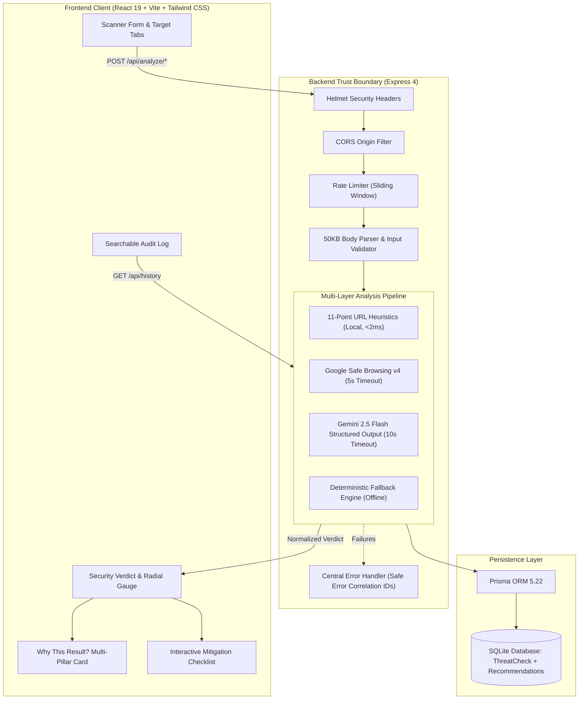
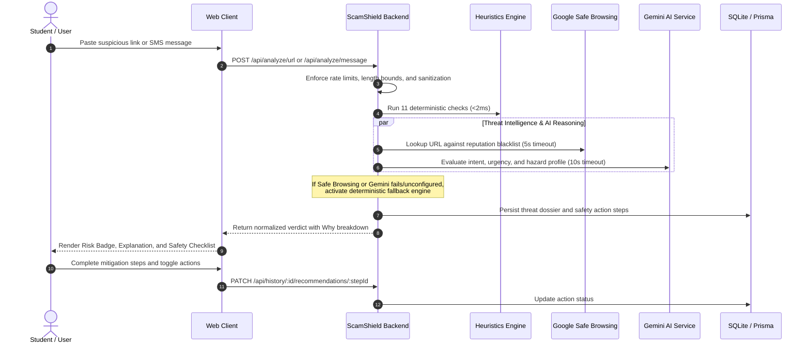

# 🛡️ ScamShield — AI Digital Safety Assistant

> **Intelligent, multi-layered threat radar protecting users and students against deceptive phishing URLs, credential-harvesting portals, and urgent social engineering scams.**  
> *Developed for PromptWars X Error Zero Hackathon • Track: AI-Powered Cybersecurity & Digital Safety*

---

## 1. Problem Statement

Digital fraud has evolved beyond obvious spam into hyper-targeted social engineering:
- **Lookalike Academic & Banking Portals**: Attackers deploy deceptive subdomains and low-reputation TLDs (e.g. `.xyz`, `.top`, `.tk`) mimicking university LMS portals, student aid dashboards, and payment processors.
- **Urgent Credential Coercion**: Fake administrative alerts pressure students to share 6-digit OTPs, passwords, or UPI credentials under immediate threats of account closure or exam disqualification.
- **Technical Literacy Gaps**: Victims frequently lack the deep cybersecurity training needed to dissect obfuscated URLs, recognize punycode homoglyphs, or verify SSL issuer reputations under pressure.

---

## 2. Why This Matters

Phishing remains the primary entry point for over 80% of reported cyberattacks. For students and everyday digital citizens:
- A single compromised account can lead to identity theft, drained student accounts, or academic disciplinary action.
- Generic antivirus tools often fail to catch zero-day phishing sites before they are cataloged by global blocklists.
- Users need immediate, plain-language triage that does not merely assign an opaque score, but explains **why** a message is dangerous and provides an **interactive step-by-step mitigation plan**.

---

## 3. Solution Overview

**ScamShield** bridges deterministic heuristic analysis, external reputation feeds, and generative AI reasoning:
1. **Deterministic Heuristics Engine**: Evaluates 11 structural signals (IP hosts, brand spoofing, suspicious TLDs, excessive subdomains, shortener domains, unencrypted HTTP) in under 2ms.
2. **Reputation Threat Feed**: Queries the Google Safe Browsing Lookup API v4 for confirmed malicious listings, degrading gracefully to `"unavailable"` when unconfigured or offline.
3. **Gemini 2.5 Flash Reasoning**: Synthesizes a structured threat classification, calculates confidence, translates technical findings into plain language, and generates an interactive mitigation checklist.
4. **Resilient Local Fallback**: When external AI services or network calls are unavailable, ScamShield executes deterministic offline pattern matching for instant, dependable protection.

---

## 4. Feature List

- **🔍 Dual-Mode Input Scanner**: Analyze suspect URLs or copy-pasted messages (SMS, WhatsApp, Telegram, email).
- **⚙️ 11-Point Structural Heuristics**: Immediate deterministic detection of brand spoofing, unencrypted HTTP, suspicious TLDs, IP hosts, and URL shorteners.
- **🌐 Google Safe Browsing v4 Integration**: Real-time reputation feed check with resilient fallback handling.
- **🤖 Gemini AI Structured Reasoning**: Strict schema-validated threat assessments, plain-language summaries, and mitigation steps.
- **🧭 "Why This Result?" Multi-Pillar Breakdown**: Transparently details findings across deterministic checks, external feeds, AI intent reasoning, and confidence limitations.
- **✅ Interactive Safety Checklist**: Actionable steps to neutralize risks with persistent completion tracking.
- **📊 Threat Dossier & History Log**: Searchable, paginated audit records with client-side keyword filtering and deletion controls.
- **🎓 Student Threat Playbook**: Interactive simulator and defense playbooks covering Phishing, OTP Fraud, UPI Scams, Fake Jobs, and Identity Theft.
- **🔒 Privacy-Preserving Architecture**: Passwords and sensitive inputs are never logged; user URLs are never fetched or executed on the server.

---

## 5. Screenshots & Visual Walkthrough

Real screenshots captured directly from ScamShield:

| Home Security Radar | Threat Evaluation Verdict |
| :---: | :---: |
|  |  |
| *Input scanner with sample chips & mode tabs* | *Radial gauge, risk badges, and plain-language explanation* |

| Scam Message Analysis | Interactive Safety Checklist |
| :---: | :---: |
|  |  |
| *SMS / OTP phishing detection & urgency scoring* | *Step-by-step mitigation tracking & progress meter* |

| Telemetry & History Dashboard |
| :---: |
|  |
| *Paginated log with threat distribution metrics and deletion controls* |

---

## 6. Live Demo

- **Live Application**: *[Deployment Link Placeholder — https://scamshield.example.com]*
- **Video Walkthrough**: *[Demo Video Link Placeholder — 90-Second Walkthrough]*

---

## 7. Architecture Diagram



---

## 8. User Flow



---

## 9. Threat-Analysis Pipeline

ScamShield evaluates incoming targets through four sequential stages:

```
[Target Input]
      │
      ▼
┌─────────────────────────────────────────────────────────────┐
│ 1. Input Normalization & Sanity Validation                  │
│    • Validate scheme (http/https), reject null bytes        │
│    • URL max length: 2,048 chars | Message: 5,000 chars     │
│    • Server NEVER fetches or redirects to the remote URL    │
└─────────────────────────────────────────────────────────────┘
      │
      ▼
┌─────────────────────────────────────────────────────────────┐
│ 2. Deterministic Structural Heuristic Engine (11 Checks)    │
│    • Missing HTTPS protocol                                 │
│    • IP-address hosts (e.g. 192.168.1.1)                    │
│    • URL shortener redirection services                     │
│    • High-abuse TLDs (.xyz, .top, .tk, .cc, etc.)           │
│    • Excessive subdomains (≥ 3 depth)                       │
│    • Target brand keyword impersonation (avoiding FP)       │
│    • Suspicious path/query keywords                         │
│    • Excessive hyphens (≥ 2 in host)                        │
│    • Punycode / IDN homoglyphs (xn--)                       │
│    • Non-standard port exposure (e.g. :8080, :8443)         │
│    • High-entropy domain tokens                             │
└─────────────────────────────────────────────────────────────┘
      │
      ▼
┌─────────────────────────────────────────────────────────────┐
│ 3. External Reputation Feed (Google Safe Browsing v4)       │
│    • Query malware, social engineering, and unwanted lists  │
│    • 5-second AbortController timeout guard                 │
│    • Return 'unavailable' if unconfigured; never false safe │
└─────────────────────────────────────────────────────────────┘
      │
      ▼
┌─────────────────────────────────────────────────────────────┐
│ 4. Cognitive Intent Reasoning (Gemini AI + Fallback)        │
│    • Schema-validated structured JSON output                │
│    • 10-second AbortController timeout                      │
│    • Evaluates urgency coercion, credential harvesting traps │
│    • Deterministic keyword-tree fallback if offline/quota   │
└─────────────────────────────────────────────────────────────┘
      │
      ▼
[Normalized Verdict + Why Breakdown + Safety Action Steps]
```

---

## 10. Tech Stack

- **Frontend**: React 19, Vite 8, Tailwind CSS v4, React Router v7.
- **Backend**: Node.js (ESM), Express 4, Helmet, CORS, Express Rate Limit.
- **Database**: Prisma ORM 5.22, SQLite.
- **AI & Threat Intelligence**: Google Gemini 2.5 Flash (`@google/genai`), Google Safe Browsing Lookup API v4.
- **Static Analysis & Testing**: Vitest 5, `@testing-library/react`, `@vitest/coverage-v8`, jsdom, Supertest, oxlint.

---

## 11. Folder Structure

```
scamshield/
├── client/                     # Frontend Single Page Application
│   ├── src/
│   │   ├── api/client.js       # Centralized API service client
│   │   ├── components/         # Button, Card, RiskBadge, LoadingSpinner, etc.
│   │   ├── context/            # ToastProvider, ToastContext
│   │   ├── hooks/useToast.js   # Notification toast hook
│   │   ├── pages/              # HomePage, ResultPage, HistoryPage, AboutPage, NotFoundPage
│   │   └── test/               # React Testing Library unit & component tests
│   ├── package.json
│   ├── vite.config.js
│   └── vitest.config.js
├── server/                     # Backend API Server
│   ├── prisma/
│   │   ├── schema.prisma       # Database models (ThreatCheck, SafetyRecommendation)
│   │   └── migrations/         # Applied SQLite migrations
│   ├── src/
│   │   ├── config/index.js     # Validated environment configuration
│   │   ├── controllers/        # Thin route controllers (analyze, history, health)
│   │   ├── middleware/         # errorHandler, rateLimiter, requestId, validateRequest
│   │   ├── routes/             # analyzeRoutes, historyRoutes, healthRoutes
│   │   ├── services/           # analysisService, urlAnalyzer, geminiAnalyzer, safeBrowsing
│   │   ├── utils/              # logger (with redaction), prismaClient
│   │   ├── validators/         # Request schema validators
│   │   ├── app.js              # Express app definition
│   │   └── index.js            # Server entrypoint with graceful shutdown
│   ├── test/                   # Vitest unit and integration tests
│   └── package.json
├── docs/screenshots/           # Real project screenshots
├── .env.example                # Safe environment template
├── .gitignore                  # Git ignore rules
├── package.json                # Root workspace orchestration
├── AUDIT_REPORT.md             # Baseline repository audit
├── SECURITY.md                 # Security policy & threat model
├── SECURITY_TEST_REPORT.md     # Security test verification report
└── PERFORMANCE_REPORT.md       # Measured latency & bundle benchmarks
```

---

## 12. Local Installation

```bash
# 1. Clone repository
git clone https://github.com/your-username/scamshield.git
cd scamshield

# 2. Run one-command workspace setup (installs client, server, and generates Prisma client)
npm run setup
```

---

## 13. Environment Variables

Copy the template to `server/.env`:

```bash
cp .env.example server/.env
```

| Variable | Required | Default | Description |
| :--- | :--- | :--- | :--- |
| `PORT` | Optional | `3001` | Backend HTTP port |
| `NODE_ENV` | Optional | `development` | Runtime environment (`development` / `production` / `test`) |
| `CLIENT_URL` | Optional | `http://localhost:5173` | Allowed CORS frontend origin |
| `DATABASE_URL` | Yes | `file:./prisma/dev.db` | SQLite database connection string |
| `GEMINI_API_KEY` | Optional | *(empty)* | Google Gemini API key (enables AI analysis; fallback used if absent) |
| `SAFEBROWSING_API_KEY` | Optional | *(empty)* | Google Safe Browsing API key (feed returns `unavailable` if absent) |

> 💡 **Offline Mode**: ScamShield operates fully even without API keys using deterministic heuristics and offline fallback classification.

---

## 14. Database Setup

```bash
# Generate Prisma client
npm --prefix server run prisma:generate

# Apply database migrations (deploy to SQLite)
npm --prefix server run prisma:deploy

# Or to run dev migrations interactively:
# npm --prefix server run prisma:migrate
```

---

## 15. Development Commands

```bash
# Start backend and frontend concurrently
npm run dev

# Or run services individually:
npm run dev:server   # Express API on http://localhost:3001
npm run dev:client   # Vite frontend on http://localhost:5173
```

---

## 16. Testing Commands

```bash
# Run the complete test suite (83 automated tests)
npm test

# Run tests with code coverage reports
npm run test:coverage

# Run static analysis and linting across the workspace
npm run lint

# Build production artifacts
npm run build
```

---

## 17. API Documentation

### `POST /api/analyze/url`
Inspects a URL using heuristics, Safe Browsing, and Gemini AI.

**Request Body**:
```json
{
  "url": "http://secure-paypal-verify.login-update.xyz"
}
```

**Response (200 OK)**:
```json
{
  "success": true,
  "data": {
    "id": "cm2...",
    "inputType": "url",
    "riskLevel": "high_risk",
    "threatType": "Phishing",
    "confidence": 0.94,
    "summary": "Deceptive URL attempting to harvest credentials.",
    "recommendedAction": "Do not enter login credentials. Close the tab immediately.",
    "heuristics": {
      "score": 85,
      "findings": [
        { "id": "tld", "label": "Suspicious TLD", "detail": ".xyz domain" },
        { "id": "brand_keyword", "label": "Brand Impersonation", "detail": "Contains paypal" }
      ]
    },
    "safeBrowsing": { "status": "unavailable", "details": "Unconfigured or offline" },
    "safetyRecommendations": [
      { "id": "rec-1", "action": "Do not enter passwords", "completed": false }
    ],
    "whyThisResult": {
      "deterministicChecks": "3 heuristic rules triggered",
      "externalReputation": "Unavailable",
      "aiInterpretation": "Phishing mimicry pattern recognized",
      "limitations": "Heuristics cannot guarantee zero-day safety"
    }
  }
}
```

### `POST /api/analyze/message`
Inspects SMS, email, or chat messages for social engineering.

**Request Body**:
```json
{
  "message": "Your university LMS account expires in 15 mins. Send OTP to 99999 to verify."
}
```

### `GET /api/history?page=1&limit=10&type=all`
Retrieves paginated scan history. `type` can be `all`, `url`, `message`, or `high_risk`.

### `GET /api/history/:id`
Retrieves a single inspection record by ID.

### `PATCH /api/history/:id/recommendations/:stepId`
Updates the completion status of a safety recommendation step.

### `DELETE /api/history/:id`
Deletes a scan record and its associated recommendation steps.

### `GET /api/health`
Health check endpoint reporting database connectivity and service availability.

---

## 18. Security & Privacy

See [SECURITY.md](SECURITY.md) for full details:
- **No Remote Fetching**: Server parses URLs lexically and never visits, executes, or fetches remote content.
- **Log Masking**: Input text is redacted with hash fingerprints in server logs.
- **Strict Headers**: Helmet applies CSP, HSTS, `X-Content-Type-Options: nosniff`, and `X-Frame-Options: DENY`.
- **Sliding-Window Rate Limiting**: Mitigates automated denial-of-service and brute-force abuse.
- **Prisma SQL Parameterization**: Eliminates SQL injection vulnerabilities.

---

## 19. Limitations

- **Guidance, Not a Guarantee**: Absence of a threat flag does not guarantee complete safety. Attackers continually register novel zero-day domains.
- **Private Intranet Domains**: ScamShield cannot verify internal enterprise/campus private networks (`10.0.0.0/8`, `192.168.0.0/16`).
- **Encrypted Content**: ScamShield evaluates message text submitted by the user and cannot inspect encrypted files or password-protected archives.

---

## 20. Future Roadmap

- [ ] Browser extension for automatic URL inspection during active browsing.
- [ ] OCR screenshot analysis for inspecting suspicious MMS and mobile app screenshots.
- [ ] Crowdsourced threat community reporting with honeypot verification.
- [ ] Real-time university alert feeds for campus IT administrators.

---

## 21. Contributing

We welcome contributions! Please review [CONTRIBUTING.md](CONTRIBUTING.md) and [CODE_OF_CONDUCT.md](CODE_OF_CONDUCT.md) before submitting pull requests.

---

## 22. License

This project is licensed under the **MIT License**. See the [LICENSE](LICENSE) file for details.

---

## 23. Credits & Acknowledgments

- **Google Gemini API** for structured JSON output models.
- **Google Safe Browsing** for cloud reputation feeds.
- **PromptWars X Error Zero Hackathon** organizing committee and mentors.
- **Tailwind CSS & Vite** teams for frontend tooling.
